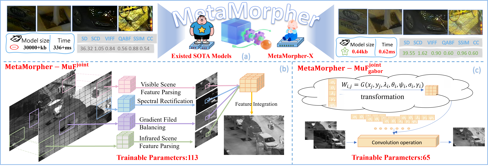

<!-- ===================================================================== -->
<!--  Metamorpher – Testing Code & Visualization README                    -->
<!--  Edit-by: Yanglin Deng                              -->
<!-- ===================================================================== -->


#  Metamorpher
**Metamorpher: A General Transformer for Compressing Multi-Modal Image Fusion Solutions**
## 📖 Paper Overview
Metamorpher proposes a **general distillation framework** which can distil arbitrary image fusion methods into an effective but super lightweight volume student network, scaling the model size by a factor of 2 to 5 orders of magnitude.

  
*Figure 1 – Overview of our contributions. (a) A comparison of the Metamorph-X (little baby) compressed by applying Metamorpher in conjunction with any
existing MMIF method (sturdy adult) in terms of model performance (both quantitative and qualitative). Pursuing performance, existing methods usually
sacrifice computational efficiency. Remarkably, our super lightweight method is not only extremely computationally efficient, but is capable of improving
performance as well. (b) A functional analysis of the 113 parameters in our MetaMorph-MuFjoint network. (c) The forward propagation process of the
MetaMorph-MuFjoint
gabor and the principle of parameter transformation.*

---

## 🗂️ Pre-trained Weights & Evaluation(on MSRS)

### 1.  SOTAs --- Teacher Models (Buffer-Alignment Teachers) --- Distilled Super-lightweight Students

| Method | Checkpoint                                                                                                                                        | Volume<br>(KB)&uarr; | SD&uarr; | SCD&uarr; | VIF&uarr; | Qabf&uarr; | SSIM&uarr; | CC&uarr; |
| :--- |:--------------------------------------------------------------------------------------------------------------------------------------------------| ---: | ---: | ---: | ---: | ---: | ---: | ---: |
| **MetaFusion** (SOTA) | [MetaFusion code]( https://github.com/wdzhao123/MetaFusion)                                                     | 3170.76 | 39.64 | 1.50 | 0.71 | 0.48 | 0.78 | 0.60 |
| **MetaMorph-MetaFusion**| [MetaMorph-MetaFusion.model](https://github.com/yanglinDeng/Metamorpher/blob/main/weights/apply%20to%20sota/students/MetaFusion/e100.model) | 0.44 | 36.90 | 1.65 | 0.85 | 0.59 | 0.98 | 0.62 |
| **TextFusion** (SOTA) | [TextFusion code](  https://github.com/AWCXV/TextFusion)      | 288.51 | 38.02 | 1.43 | 0.72 | 0.52 | 0.76 | 0.59 |
| **MetaMorph-TextFusion** | [MetaMorph-TextFusion.model](https://github.com/yanglinDeng/Metamorpher/blob/main/weights/apply%20to%20sota/students/TextFusion/TextFusion.model) | 0.44 | 38.07 | 1.68 | 0.87 | 0.59 | 0.98 | 0.62 |
| **CrossFuse** (SOTA) | [CrossFuse code](https://github.com/hli1221/CrossFuse)      | 10005 | 40.30 | 1.49 | 0.82 | 0.57 | 0.73 | 0.58 |
| **MetaMorph-CrossFuse** | [MetaMorph-CrossFuse.model](https://github.com/yanglinDeng/Metamorpher/blob/main/weights/apply%20to%20sota/students/CrossFuse/CrossFuse.model)    | 0.44 | 41.55 | 1.68 | 0.88 | 0.59 | 0.94 | 0.60 |
| **DCINN** (SOTA) |[DCINN code](https://github.com/wwhappylife/DCINN)                                                | 91055.39 | 36.32 | 1.05 | 0.84 | 0.56 | 0.88 | 0.54 |
| **MetaMorph-DCINN** | [MetaMorph-DCINN.model](https://github.com/yanglinDeng/Metamorpher/blob/main/weights/apply%20to%20sota/students/DCINN/DCINN.model)                | 0.44 | 39.55 | 1.62 | 0.90 | 0.60 | 0.96 | 0.60 |
| **GIFNet** (SOTA) |[GIFNet code](https://github.com/AWCXV/GIFNet)                                   | 3329 | 32.93 | 1.41 | 0.58 | 0.42 | 0.85 | 0.63 |
| **MetaMorph-GIFNet** | [MetaMorph-GIFNet.model](https://github.com/yanglinDeng/Metamorpher/blob/main/weights/apply%20to%20sota/students/GIFNet/GIFNet.model)             | 0.44 | 35.98 | 1.66 | 0.82 | 0.58 | 0.96 | 0.63 |
| **DeFusion** (SOTA) | [DeFusion code](https://github.com/erfect2020/DecompositionForFusion)            | 30759.66 | 34.86 | 1.29 | 0.75 | 0.51 | 0.93 | 0.60 |
| **MetaMorph-DeFusion** | [MetaMorph-DeFusion.model](https://github.com/yanglinDeng/Metamorpher/blob/main/weights/apply%20to%20sota/students/DeFusion/DeFusion.model)       | 0.44 | 40.78 | 1.59 | 0.89 | 0.59 | 0.90 | 0.61 |
| **MuFusion** (SOTA) |[MuFusion code](https://github.com/AWCXV/MUFusion)   | 2176 | 28.48 | 1.26 | 0.60 | 0.42 | 0.71 | 0.61 |
| **Metamorph-MuF<sup>joint</sup>** | [Metamorph-MuF<sup>joint</sup>.model](https://github.com/yanglinDeng/Metamorpher/blob/main/weights/MetaMorph_MuF_joint/MetaMorph_MuF_joint.model)                                                          | 0.44 | 43.08 | 1.66 | 0.90 | 0.60 | 0.97 | 0.61 |

### 2.  Metamorph-MuF<sup>joint</sup> & Metamorph-MuF<sup>joint</sup><sub>gabor</sub>
| Method | Checkpoint                                                                                                                                                                    | Volume<br>(KB)↑ | Flops<br>(G) | Time<br>(MS) | SD↑ | SCD↑ | VIF↑ | Qabf↑ | SSIM↑ | CC↑ |
| :--- |:------------------------------------------------------------------------------------------------------------------------------------------------------------------------------| ---: | ---: | ---: | ---: | ---: | ---: | ---: | ---: | ---: |
| **Metamorph-MuF<sup>joint</sup>** | [Metamorph-MuF<sup>joint</sup>.model](https://github.com/yanglinDeng/Metamorpher/blob/main/weights/MetaMorph_MuF_joint/MetaMorph_MuF_joint.model)                             | 0.44 | 0.142 | 0.62 | 43.08 | 1.66 | 0.90 | 0.60 | 0.97 | 0.61 |
| **Metamorph-MuF<sup>joint</sup><sub>gabor</sub>** | [Metamorph-MuF<sup>joint</sup><sub>gabor</sub>.model](https://github.com/yanglinDeng/Metamorpher/blob/main/weights/MetaMorph_MuF_joint_gabor/MetaMorph_MuF_joint_gabor.model) | 0.25 | 0.142 | 0.42 | 40.31 | 1.83 | 0.88 | 0.61 | 1.00 | 0.63 |


## 🚀 Quick Start
### 1. 📥 Clone

```bash
#
git clone https://github.com/yanglinDeng/Metamorpher
cd Metamorpher
```

### 2.🛠️ Environment

```bash
conda create -n metamorpher python=3.7.3
conda activate metamorpher
pip install -r requirements.txt
```

### 3.🏆 Performance Testing of Distilled SOTA Students

```bash
python test_metamorpher_x.py \
  --test_root test_imgs/LLVIP250 \
  --model_dir weights/apply to sota/students/MetaFusion.model \
  --out_root outputs/apply to sota/students/MetaFusion/fused_imgs \
  --result_file outputs/apply to sota/students/MetaFusion/result.txt\
  --show_middle false \
  --num_imgs 250 \
```

### 4. 🧪 Performance Testing of MiniFusion and  visualizing intermidiate feature maps

```bash
python test_metamorpher_x.py \
  --test_root test_imgs/LLVIP250 \
  --model_dir weights/MetaMorph_MuF_joint/MetaMorph_MuF_joint.model \
  --out_root outputs/MetaMorph_MuF_joint/fused_imgs \
  --result_file outputs/MetaMorph_MuF_joint/result.txt\
  --show_middle true \
  --num_imgs 250 \
```
### 5. ⚡ Performance Testing of MiniGFilter

```bash
python test_metamorpher_joint_gabor.py \
  --test_root test_imgs/LLVIP250 \
  --model_dir weights/MetaMorph_MuF_joint_gabor/MetaMorph_MuF_joint_gabor.model \
  --out_root outputs/MetaMorph_MuF_joint_gabor/fused_imgs \
  --result_file outputs/MetaMorph_MuF_joint_gabor/result.txt\
  --num_imgs 250 \
```

📁 File Tree
<pre>
metamorpher/
├── imgs/
├── weights/                      # pre-trained checkpoints
│   ├── apply to sota/
│   │   ├── students/             # 7 SOTA super-lightweight student ckpts
│   ├── MiniFusion/
│   └── MiniGFilter/
├── test_imgs/                    # IR/VI samples
└── outputs/                      # auto-generated outputs
    ├── apply to sota/
    │   └── student/
    ├── MiniFusion/
    └── MiniGFilter/
</pre>

⭐ If this repo helps your research, please give us a star! ⭐

## Contact Informaiton
If you have any questions, please contact me at <yanglin_deng@163.com>.
